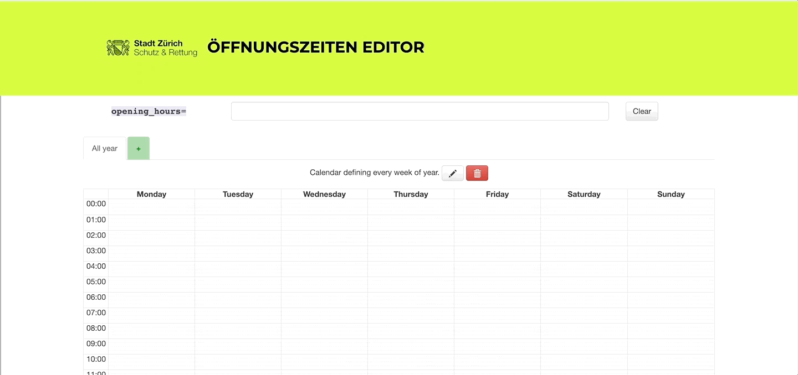

# Schutz und Rettung - Öffnungszeiten Editor

Öffnungszeiten Editor für die Mapper von Schutz & Rettung und andere Interessierte.

## Anwendung

#### Link

[SRZ Hours im Internet](https://srzhours.srz.borsnet.ch)s

### Kalenderansicht

Ziehe auf der Kalender-Ansicht die Öffnungszeiten die du gerne in opening_hours eintragen möchtest. Der Editor funktioniert hier wie ein normaler Kalender. Wenn du also Mo-Fr 08:00-17:00, Sa 08:00-13:30 eintragen willst, ziehe die Felder dieser Zeiten einfach auf dem Kalender (siehe Bild oben). Die Werte werden dann in OSM konformem Format in das Feld `opening_hours` geschrieben. Kopiere diesen Eintrag.

Solltest du andere Ansichten als die Wochenansicht benötigen, kannst du die Ansicht oben ändern. Diese Funktion hilft dir vor allem bei Einträgen die vorallem saisonal, resp. während wenigen Monaten verfügbar sind (z.B Badis).

### Werte in opening_hours

Die Werte die du im Formular erhältst und kopiert hast, musst du dann im ID Editor oder in JOSM in das Feld opening_hours schreiben:

`opening_hours = Wert aus dem Formular`

Nun kannst du deine Änderung im richtigen Format hochladen. Cool oder?

#### Credit

Die Software basiert auf dem von [Adrien Pavie](https://github.com/PanierAvide)'s erstellten
[YoHours Applikation](http://projets.pavie.info/yohours/) und wurde 1:1 übernommen.

#### License

Copyright 2015 Adrien PAVIE, 2020 Schutz & Rettung Zürich

See [LICENSE](LICENSE) for complete AGPL3 license.
