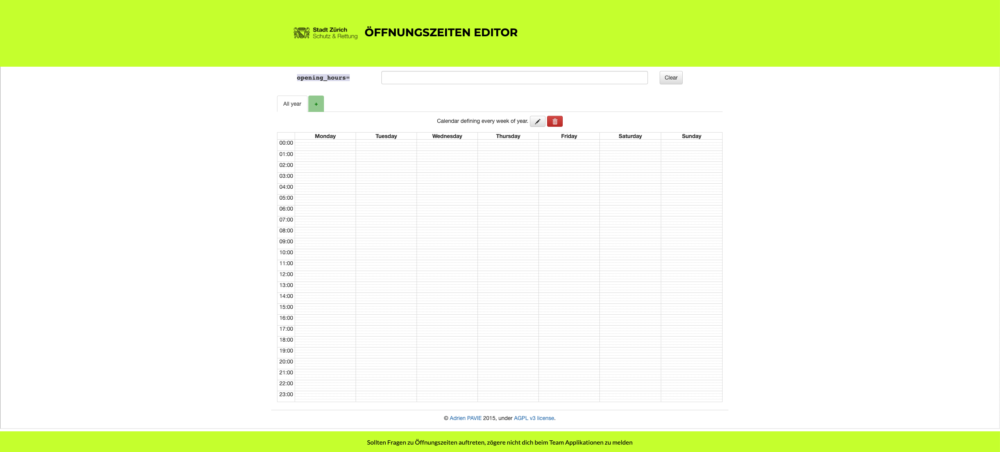

# Schutz und Rettung - Öffnungszeiten Editor

Öffnungszeiten Editor für die Mapper von Schutz & Rettung und andere Interessierte

## Anwendung

### Kalenderansicht

Ziehe auf der Kalender-Ansicht die Öffnungszeiten die du gerne in opening_hours

### Werte in opening_hours

#### Credit

Die Software basiert auf dem von [Adrien Pavie](https://github.com/PanierAvide)'s erstellten
[YoHours Applikation](http://projets.pavie.info/yohours/) und wurde 1:1 übernommen.

#### License

Copyright 2015 Adrien PAVIE, 2020 Schutz & Rettung Zürich

See [LICENSE](LICENSE) for complete AGPL3 license.

YoHours is free software: you can redistribute it and/or modify
it under the terms of the GNU Affero General Public License as published by
the Free Software Foundation, either version 3 of the License, or
(at your option) any later version.

YoHours is distributed in the hope that it will be useful,
but WITHOUT ANY WARRANTY; without even the implied warranty of
MERCHANTABILITY or FITNESS FOR A PARTICULAR PURPOSE.  See the
GNU Affero General Public License for more details.

You should have received a copy of the GNU Affero General Public License
along with YoHours. If not, see <http://www.gnu.org/licenses/>.